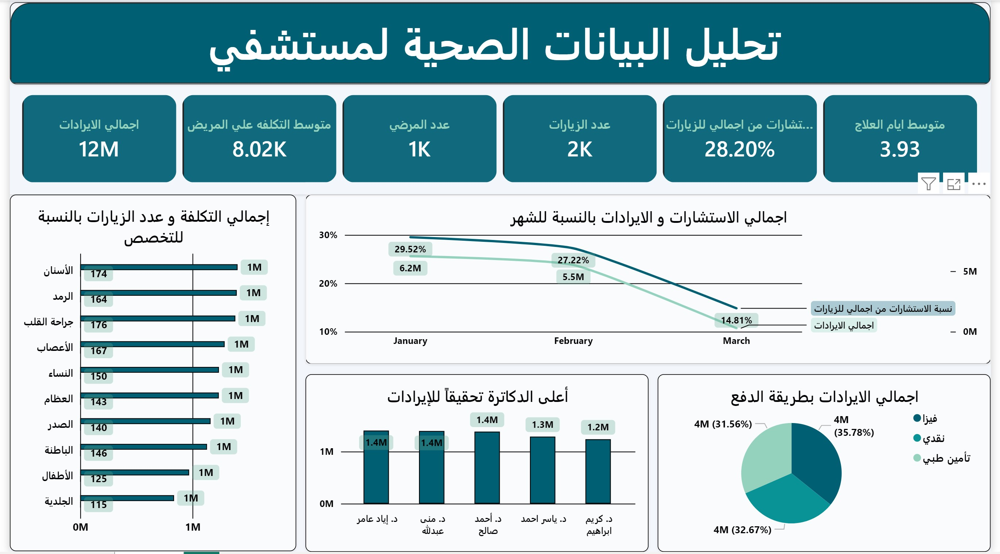

# 🏥 Healthcare Analytics Dashboard

A comprehensive Power BI healthcare analytics solution featuring patient analysis, operational performance, resource utilization, and executive KPI dashboards. This project transforms clinical and hospital data into actionable business intelligence to optimize patient care pipelines and streamline hospital management metrics.

---

## 📌 Project Overview
In the medical and healthcare sector, maximizing operational efficiency while maintaining top-tier patient care is essential. This repository provides a complete analytical suite monitoring hospital operations.

By tracking patient demographics, admission trends, resource utilization rates, and executive clinical KPIs, this dashboard equips healthcare administrators with data-driven strategic insights.

---

## 📂 Repository Structure
As shown in the project repository structure, the files are organized systematically as follows:

*   **`Data/`**: Contains the foundational healthcare datasets used for patient and operational analysis.
*   **`HC.pbix`**: The master Power BI Desktop application containing the semantic data models, table relationships, and interactive visual charts.
*   **`HC.pdf`**: A high-quality static report export of the final dashboard for quick presentations or portfolio viewing.
*   **`Dash.jpg`**: A high-resolution layout preview capturing the core healthcare dashboard interface view.

---

## 📄 View Full Report (PDF)
You can view or download the complete high-quality PDF version of the dashboard directly from this repository:

👉 **[Click Here to Open HC.pdf](HC.pdf)**

---

## 📸 Dashboard Preview
Explore the primary healthcare analytical interface view directly below:

---

## 🚀 Key Features & Insights
*   **Patient Admissions & Demographics**: Evaluating patient volume flows, treatment durations, and dynamic classification metrics.
*   **Hospital Operational Performance**: Comprehensive KPIs monitoring bed occupancy rates, department velocity, and resource distribution bottlenecks.
*   **Executive Insights Matrix**: Strategic high-level tracking dashboards designed to enhance healthcare delivery trends and clinical efficiency.

---

## 🛠️ Tools & Technologies Used
*   **Power BI Desktop**: Structural data modeling, advanced cross-filtering layout design, and clean data storytelling workflows.
*   **Power Query**: Robust data cleaning, handling missing health values, dimensional type adjustments, and structural ETL configurations.
*   **DAX (Data Analysis Expressions)**: Custom formulas optimizing clinical KPI aggregates, average lengths of stay, and operational metric trends.

---

## 🧑‍💻 Author
*   **Aya Khaled Mohamed**
    *   Data Analyst & Business Intelligence Specialist
    *   [LinkedIn Profile](https://www.linkedin.com/in/aya-k-mohamed-58474b2b7)
    *   [GitHub Profile](https://github.com/aya-khaled-mohamed)

---
*If you find this healthcare performance optimization portfolio project valuable, feel free to give this repository a ⭐ to show your support!*
